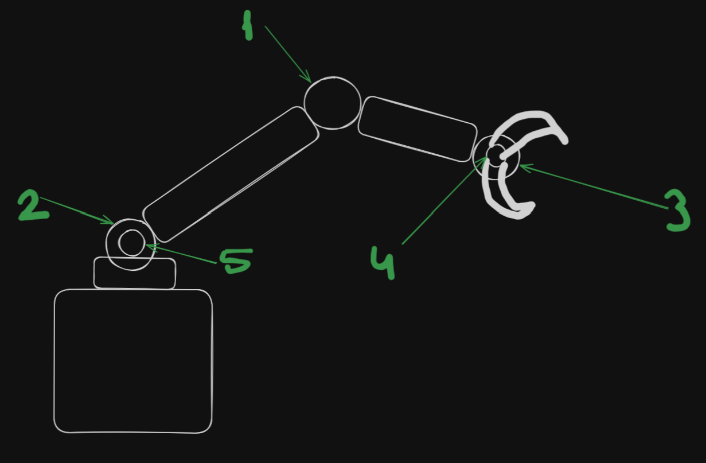

# ContArm
A Web based controller for 6 axix robot controller.

# Arduino

# Client
I used Python and web technologies for this project.

**Python**
 - I used [Flask](https://github.com/pallets/flask) for take data from web in order to send Arduino.
 - I used [pySerial](https://github.com/pyserial/pyserial) for send data to Arduino in designated format.

**Arduino**

Image of joints